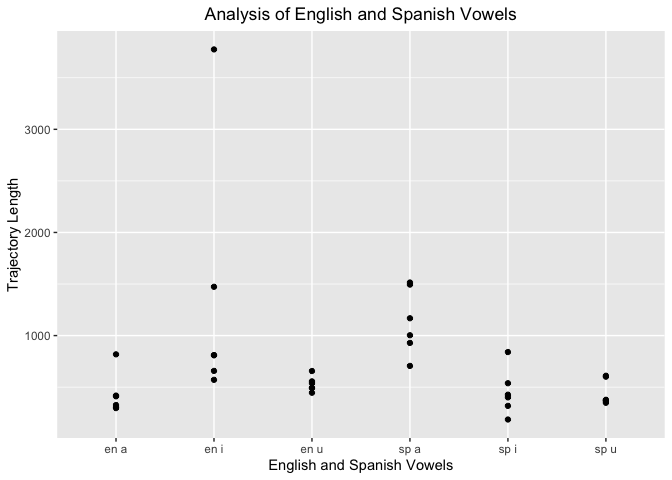
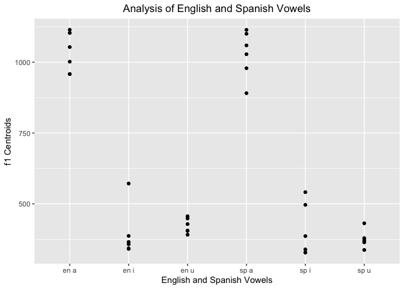
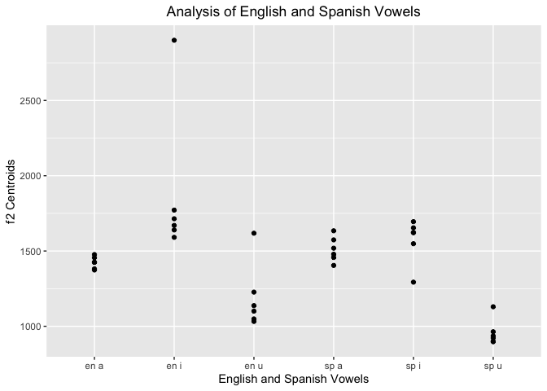
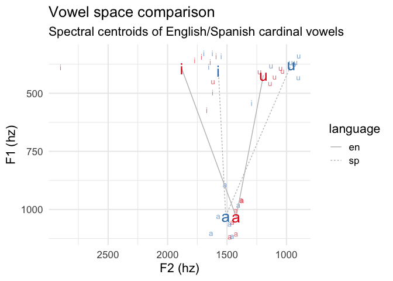
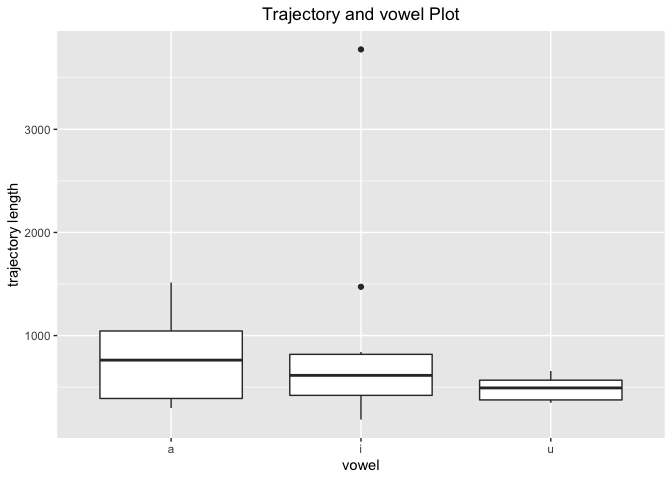
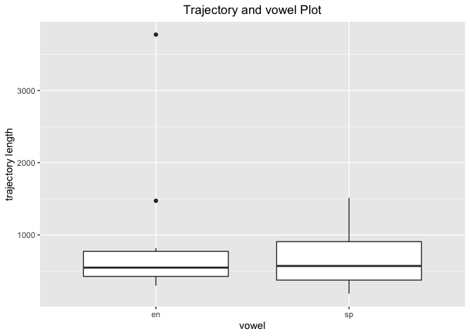
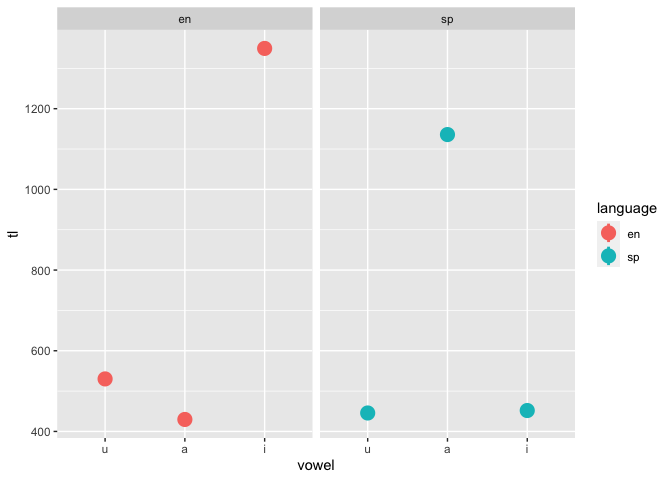

``` r
library("dplyr")   
```

    ## 
    ## Attaching package: 'dplyr'

    ## The following objects are masked from 'package:stats':
    ## 
    ##     filter, lag

    ## The following objects are masked from 'package:base':
    ## 
    ##     intersect, setdiff, setequal, union

``` r
library("ggplot2")
library("readr")  
library("here")    
```

    ## here() starts at /Users/princesa/Desktop/pa_3

``` r
library("tidyr") 
library("stringr")
library("kableExtra")
```

    ## 
    ## Attaching package: 'kableExtra'

    ## The following object is masked from 'package:dplyr':
    ## 
    ##     group_rows

### load data.csv

``` r
my_data <- read.csv(file = "/Users/princesa/Desktop/pa_3/data/vowel_data.csv")
```

### Calculate means and standard deviations of your English/Spanish vowels

# Average and Standard Deviations for columns f1, f2, tl

``` r
my_data %>%
    summarize(f1_cent_avg = mean(f1_cent))
```

    ##   f1_cent_avg
    ## 1    609.0836

``` r
sd(my_data$f1_cent)
```

    ## [1] 309.2343

``` r
my_data %>%
    summarize(f2_cent_avg = mean(f2_cent))
```

    ##   f2_cent_avg
    ## 1     1423.37

``` r
sd(my_data$f2_cent)
```

    ## [1] 368.0302

``` r
my_data %>%
    summarize(tl_avg = mean(tl))
```

    ##     tl_avg
    ## 1 723.7872

``` r
sd(my_data$tl)
```

    ## [1] 624.5157

# Table analysis to view averages

``` r
summary(my_data) %>%
  kbl(caption = "Data Summary") %>%
  kable_classic(full_width = F, html_font = "Cambria")
```

<table class=" lightable-classic" style="font-family: Cambria; width: auto !important; margin-left: auto; margin-right: auto;">
<caption>
Data Summary
</caption>
<thead>
<tr>
<th style="text-align:left;">
</th>
<th style="text-align:left;">
id
</th>
<th style="text-align:left;">
item
</th>
<th style="text-align:left;">
vowel
</th>
<th style="text-align:left;">
language
</th>
<th style="text-align:left;">
f1_cent
</th>
<th style="text-align:left;">
f2_cent
</th>
<th style="text-align:left;">
tl
</th>
<th style="text-align:left;">
f1_20
</th>
<th style="text-align:left;">
f1_35
</th>
<th style="text-align:left;">
f1_50
</th>
<th style="text-align:left;">
f1_65
</th>
<th style="text-align:left;">
f1_80
</th>
<th style="text-align:left;">
f2_20
</th>
<th style="text-align:left;">
f2_35
</th>
<th style="text-align:left;">
f2_50
</th>
<th style="text-align:left;">
f2_65
</th>
<th style="text-align:left;">
f2_80
</th>
</tr>
</thead>
<tbody>
<tr>
<td style="text-align:left;">
</td>
<td style="text-align:left;">
Length:36
</td>
<td style="text-align:left;">
Length:36
</td>
<td style="text-align:left;">
Length:36
</td>
<td style="text-align:left;">
Length:36
</td>
<td style="text-align:left;">
Min. : 327.9
</td>
<td style="text-align:left;">
Min. : 897.5
</td>
<td style="text-align:left;">
Min. : 186.2
</td>
<td style="text-align:left;">
Min. : 312.4
</td>
<td style="text-align:left;">
Min. : 320.1
</td>
<td style="text-align:left;">
Min. : 320.6
</td>
<td style="text-align:left;">
Min. : 333.1
</td>
<td style="text-align:left;">
Min. : 337.8
</td>
<td style="text-align:left;">
Min. : 832.4
</td>
<td style="text-align:left;">
Min. : 830.5
</td>
<td style="text-align:left;">
Min. : 831
</td>
<td style="text-align:left;">
Min. : 828.5
</td>
<td style="text-align:left;">
Min. : 766.6
</td>
</tr>
<tr>
<td style="text-align:left;">
</td>
<td style="text-align:left;">
Class :character
</td>
<td style="text-align:left;">
Class :character
</td>
<td style="text-align:left;">
Class :character
</td>
<td style="text-align:left;">
Class :character
</td>
<td style="text-align:left;">
1st Qu.: 365.3
</td>
<td style="text-align:left;">
1st Qu.:1135.4
</td>
<td style="text-align:left;">
1st Qu.: 395.0
</td>
<td style="text-align:left;">
1st Qu.: 355.9
</td>
<td style="text-align:left;">
1st Qu.: 344.9
</td>
<td style="text-align:left;">
1st Qu.: 341.7
</td>
<td style="text-align:left;">
1st Qu.: 351.1
</td>
<td style="text-align:left;">
1st Qu.: 363.9
</td>
<td style="text-align:left;">
1st Qu.:1198.7
</td>
<td style="text-align:left;">
1st Qu.:1197.7
</td>
<td style="text-align:left;">
1st Qu.:1105
</td>
<td style="text-align:left;">
1st Qu.:1126.9
</td>
<td style="text-align:left;">
1st Qu.:1144.5
</td>
</tr>
<tr>
<td style="text-align:left;">
</td>
<td style="text-align:left;">
Mode :character
</td>
<td style="text-align:left;">
Mode :character
</td>
<td style="text-align:left;">
Mode :character
</td>
<td style="text-align:left;">
Mode :character
</td>
<td style="text-align:left;">
Median : 430.0
</td>
<td style="text-align:left;">
Median :1456.4
</td>
<td style="text-align:left;">
Median : 547.2
</td>
<td style="text-align:left;">
Median : 472.3
</td>
<td style="text-align:left;">
Median : 414.6
</td>
<td style="text-align:left;">
Median : 381.5
</td>
<td style="text-align:left;">
Median : 449.9
</td>
<td style="text-align:left;">
Median : 466.7
</td>
<td style="text-align:left;">
Median :1486.1
</td>
<td style="text-align:left;">
Median :1462.5
</td>
<td style="text-align:left;">
Median :1359
</td>
<td style="text-align:left;">
Median :1332.0
</td>
<td style="text-align:left;">
Median :1423.8
</td>
</tr>
<tr>
<td style="text-align:left;">
</td>
<td style="text-align:left;">
NA
</td>
<td style="text-align:left;">
NA
</td>
<td style="text-align:left;">
NA
</td>
<td style="text-align:left;">
NA
</td>
<td style="text-align:left;">
Mean : 609.1
</td>
<td style="text-align:left;">
Mean :1423.4
</td>
<td style="text-align:left;">
Mean : 723.8
</td>
<td style="text-align:left;">
Mean : 606.1
</td>
<td style="text-align:left;">
Mean : 609.1
</td>
<td style="text-align:left;">
Mean : 603.8
</td>
<td style="text-align:left;">
Mean : 620.7
</td>
<td style="text-align:left;">
Mean : 605.7
</td>
<td style="text-align:left;">
Mean :1477.7
</td>
<td style="text-align:left;">
Mean :1465.1
</td>
<td style="text-align:left;">
Mean :1377
</td>
<td style="text-align:left;">
Mean :1382.6
</td>
<td style="text-align:left;">
Mean :1414.4
</td>
</tr>
<tr>
<td style="text-align:left;">
</td>
<td style="text-align:left;">
NA
</td>
<td style="text-align:left;">
NA
</td>
<td style="text-align:left;">
NA
</td>
<td style="text-align:left;">
NA
</td>
<td style="text-align:left;">
3rd Qu.: 963.4
</td>
<td style="text-align:left;">
3rd Qu.:1622.0
</td>
<td style="text-align:left;">
3rd Qu.: 812.5
</td>
<td style="text-align:left;">
3rd Qu.: 915.0
</td>
<td style="text-align:left;">
3rd Qu.: 951.5
</td>
<td style="text-align:left;">
3rd Qu.: 973.7
</td>
<td style="text-align:left;">
3rd Qu.: 976.1
</td>
<td style="text-align:left;">
3rd Qu.: 963.2
</td>
<td style="text-align:left;">
3rd Qu.:1693.8
</td>
<td style="text-align:left;">
3rd Qu.:1635.9
</td>
<td style="text-align:left;">
3rd Qu.:1558
</td>
<td style="text-align:left;">
3rd Qu.:1571.8
</td>
<td style="text-align:left;">
3rd Qu.:1634.7
</td>
</tr>
<tr>
<td style="text-align:left;">
</td>
<td style="text-align:left;">
NA
</td>
<td style="text-align:left;">
NA
</td>
<td style="text-align:left;">
NA
</td>
<td style="text-align:left;">
NA
</td>
<td style="text-align:left;">
Max. :1114.5
</td>
<td style="text-align:left;">
Max. :2899.7
</td>
<td style="text-align:left;">
Max. :3774.9
</td>
<td style="text-align:left;">
Max. :1207.5
</td>
<td style="text-align:left;">
Max. :1173.1
</td>
<td style="text-align:left;">
Max. :1305.4
</td>
<td style="text-align:left;">
Max. :1218.9
</td>
<td style="text-align:left;">
Max. :1286.1
</td>
<td style="text-align:left;">
Max. :2827.1
</td>
<td style="text-align:left;">
Max. :2978.0
</td>
<td style="text-align:left;">
Max. :2846
</td>
<td style="text-align:left;">
Max. :2731.5
</td>
<td style="text-align:left;">
Max. :3115.5
</td>
</tr>
</tbody>
</table>

``` r
table(my_data$vowel)
```

    ## 
    ##  a  i  u 
    ## 12 12 12

``` r
table(my_data$language)
```

    ## 
    ## en sp 
    ## 18 18

### Plots

# 1. Plot trajectory length as a function of vowel and language

Using paste() to join two variables as one string variable.

``` r
ggplot(my_data,aes(y=tl,x=paste(language,vowel)))+
  geom_point() +
  labs(x = "English and Spanish Vowels", y = "Trajectory Length",
  title = "Analysis of English and Spanish Vowels") +
  theme(plot.title = element_text(hjust = 0.5))
```

<!-- -->

# 2. Plot F1 as a function of vowel and language

``` r
ggplot(my_data,aes(y=f1_cent, x=paste(language,vowel)))+
  geom_point() +
  labs(x = "English and Spanish Vowels", y = "f1 Centroids",
  title = "Analysis of English and Spanish Vowels") +
  theme(plot.title = element_text(hjust = 0.5))
```

<!-- -->

# 3. Plot F2 as a function of vowel and language

``` r
ggplot(my_data,aes(y=f2_cent, x=paste(language,vowel)))+
  geom_point() +
  labs(x = "English and Spanish Vowels", y = "f2 Centroids",
  title = "Analysis of English and Spanish Vowels") +
  theme(plot.title = element_text(hjust = 0.5))
```

<!-- -->

``` r
vowel_means <- my_data %>% 
  group_by(vowel, language) %>% 
  summarize(f1_cent = mean(f1_cent), f2_cent = mean(f2_cent)) %>% 
  ungroup() %>% 
  mutate(order = case_when(vowel == "i" ~ 1, vowel == "a" ~ 2, TRUE ~ 3), 
         vowel = forcats::fct_reorder2(vowel, vowel, order)) %>% 
  arrange(order)
```

    ## `summarise()` has grouped output by 'vowel'. You can override using the
    ## `.groups` argument.

``` r
my_data %>% 
  mutate(vowel = forcats::fct_relevel(vowel, "u", "a", "i")) %>% 
  ggplot(., aes(x = f2_cent, y = f1_cent, color = language, label = vowel)) + 
    geom_text(size = 3.5, alpha = 0.6, show.legend = F) + 
    geom_path(data = vowel_means, aes(group = language, lty = language), 
              color = "grey") + 
    geom_text(data = vowel_means, show.legend = F, size = 7) + 
    scale_y_reverse() + 
    scale_x_reverse() + 
    scale_color_brewer(palette = "Set1") + 
    labs(title = "Vowel space comparison", 
         subtitle = "Spectral centroids of English/Spanish cardinal vowels", 
         y = "F1 (hz)", x = "F2 (hz)") + 
    theme_minimal(base_size = 16)
```

<!-- -->

# Table vowel means

``` r
head(vowel_means) %>%
  kbl(caption = "Summary of Vowel Averages") %>%
  kable_classic(full_width = F, html_font = "Cambria")
```

<table class=" lightable-classic" style="font-family: Cambria; width: auto !important; margin-left: auto; margin-right: auto;">
<caption>
Summary of Vowel Averages
</caption>
<thead>
<tr>
<th style="text-align:left;">
vowel
</th>
<th style="text-align:left;">
language
</th>
<th style="text-align:right;">
f1_cent
</th>
<th style="text-align:right;">
f2_cent
</th>
<th style="text-align:right;">
order
</th>
</tr>
</thead>
<tbody>
<tr>
<td style="text-align:left;">
i
</td>
<td style="text-align:left;">
en
</td>
<td style="text-align:right;">
394.1150
</td>
<td style="text-align:right;">
1881.0383
</td>
<td style="text-align:right;">
1
</td>
</tr>
<tr>
<td style="text-align:left;">
i
</td>
<td style="text-align:left;">
sp
</td>
<td style="text-align:right;">
403.1900
</td>
<td style="text-align:right;">
1572.5950
</td>
<td style="text-align:right;">
1
</td>
</tr>
<tr>
<td style="text-align:left;">
a
</td>
<td style="text-align:left;">
en
</td>
<td style="text-align:right;">
1031.5517
</td>
<td style="text-align:right;">
1423.0417
</td>
<td style="text-align:right;">
2
</td>
</tr>
<tr>
<td style="text-align:left;">
a
</td>
<td style="text-align:left;">
sp
</td>
<td style="text-align:right;">
1028.5550
</td>
<td style="text-align:right;">
1511.1717
</td>
<td style="text-align:right;">
2
</td>
</tr>
<tr>
<td style="text-align:left;">
u
</td>
<td style="text-align:left;">
en
</td>
<td style="text-align:right;">
422.3167
</td>
<td style="text-align:right;">
1194.0817
</td>
<td style="text-align:right;">
3
</td>
</tr>
<tr>
<td style="text-align:left;">
u
</td>
<td style="text-align:left;">
sp
</td>
<td style="text-align:right;">
374.7733
</td>
<td style="text-align:right;">
958.2933
</td>
<td style="text-align:right;">
3
</td>
</tr>
</tbody>
</table>

### Plot trajectory length and vowel - Boxplot

``` r
my_data %>%
  ggplot(., aes(x = vowel, y = tl)) +
   geom_boxplot() +
  labs( y = "trajectory length", x = "vowel", title = "Trajectory and vowel Plot") +
  theme(plot.title = element_text(hjust = 0.5))
```

<!-- --> ### Plot
trajectory length and language - Boxplot

``` r
my_data %>%
  ggplot(., aes(x = language, y = tl)) +
   geom_boxplot() +
  labs( y = "trajectory length", x = "vowel", title = "Trajectory and vowel Plot") +
  theme(plot.title = element_text(hjust = 0.5))
```

<!-- -->

``` r
my_mean <- my_data %>% 
  group_by(vowel, language) %>% 
  summarize(f1_cent = mean(f1_cent), f2_cent = mean(f2_cent), tl = mean(tl)) %>% 
  ungroup() %>% 
  mutate(order = case_when(vowel == "i" ~ 1, vowel == "a" ~ 2, TRUE ~ 3), 
         vowel = forcats::fct_reorder2(vowel, vowel, order)) %>% 
  arrange(order)
```

    ## `summarise()` has grouped output by 'vowel'. You can override using the
    ## `.groups` argument.

``` r
my_mean %>%
  ggplot(aes(x = vowel, y = tl, color = language)) +
  facet_grid(cols = vars(language)) +
  stat_summary(fun = mean, 
               geom = "pointrange", size = 1,
               position = position_dodge(width = 0.5)) 
```

    ## Warning: Removed 3 rows containing missing values (geom_segment).
    ## Removed 3 rows containing missing values (geom_segment).

<!-- -->

``` r
  #scale_x_continuous(breaks = seq(0, 8, 1)) 
```

### Answers to Question 7

7a. The sample script provided allows the analysis of vowels.
Specifically, it calculates the acoustic properties. The code will
calculate a vowel’s onset, offset, and midpoint (durationV). The code
“per20” allows us to analyze the percentage value. The code works
because the path allows it to fetch the data from the pa_3 folder to
compute the script. The code is written in a way that it will capture
percentages in increments of 15%.

7b. The general outline of the script is to extract data from the
recorded files. It extracts vowel formats (F1 and F2) by viewing
textgrid and sound files. This is completed by including the pathway
(savePath$) to where the files are located. The script is designed to
quickly gather data and organize it (in a format for further analysis.
The script also includes loops. This allows for completing a repetitive
task instead of manually doing it. The script will create a .csv file
which can be used to further analyze.

7c. The segmenting procedures we used for pa_2 and pa_3 were different.
We had little data to analyze in pa_2, which made it feasible. In
contrast, we had various words in English and Spanish to analyze in
pa_3, this is why we used loops for this week’s project. An advantage of
using loops (pa_3) is that we can analyze various sounds very quickly.
The Praat script was also important as it allowed us to gather centroids
and trajectory lengths quickly.
